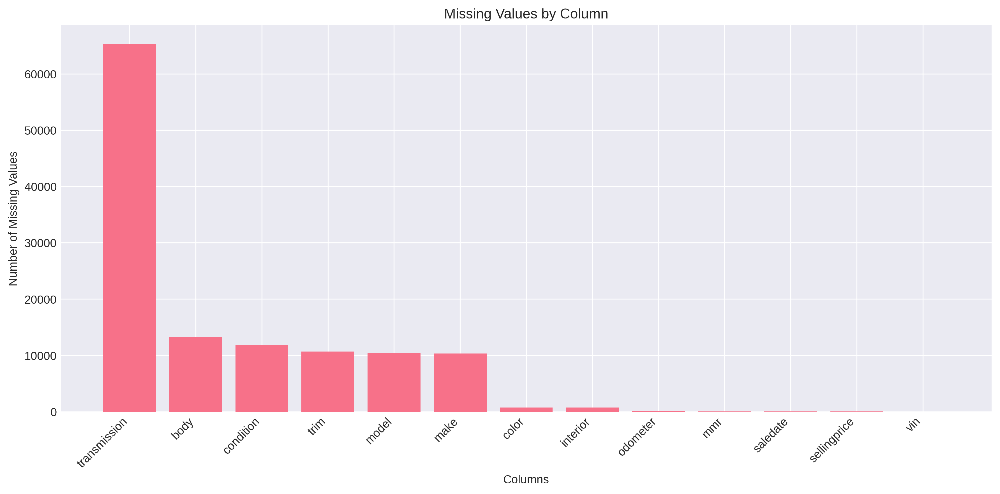
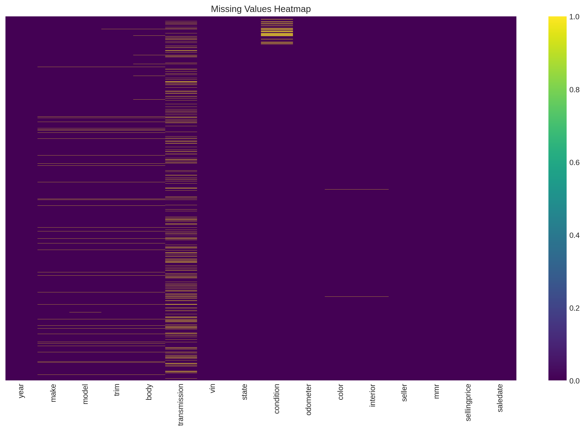
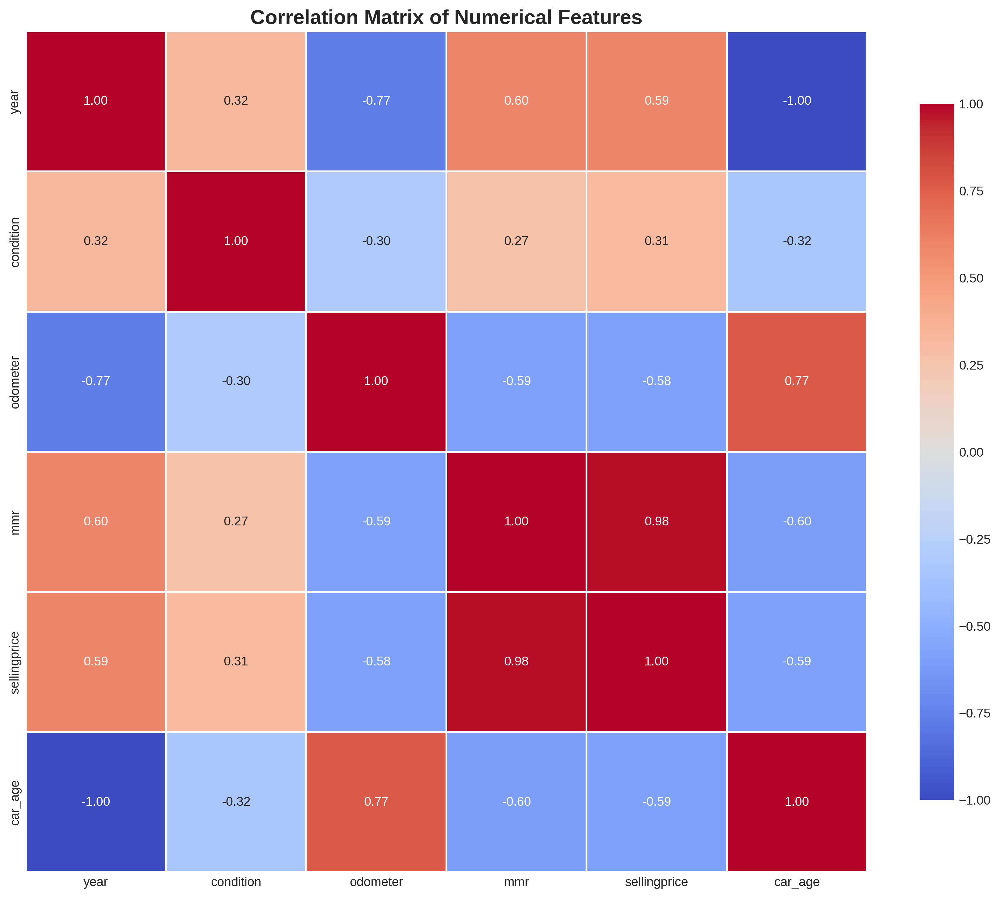
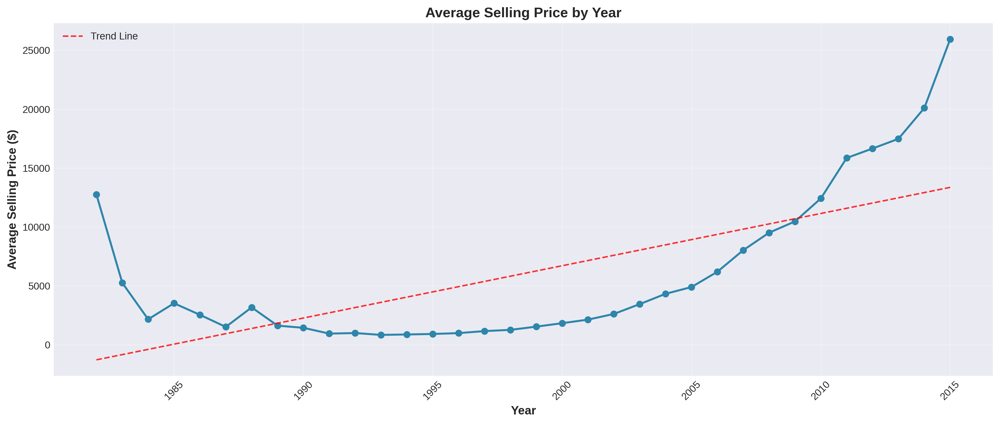
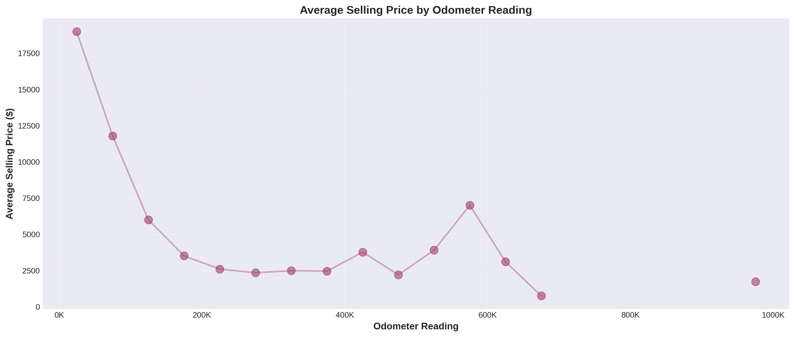
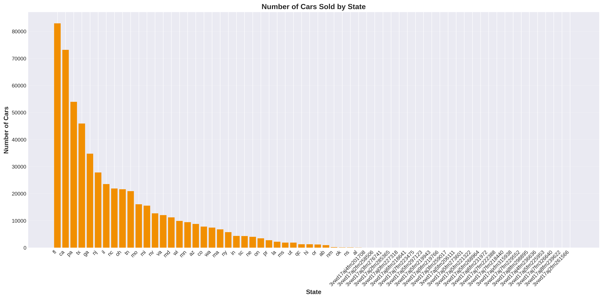
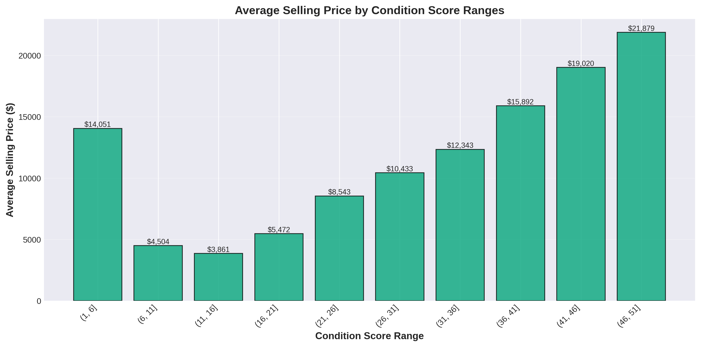
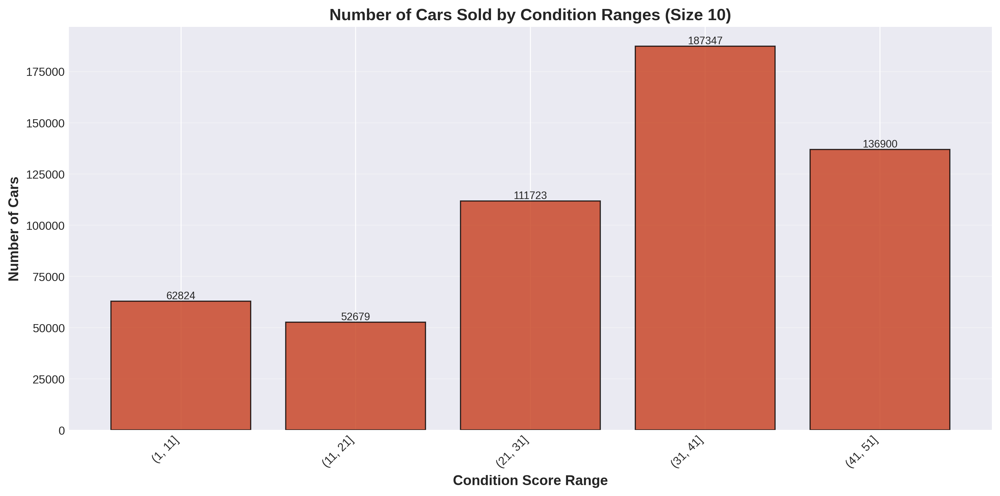
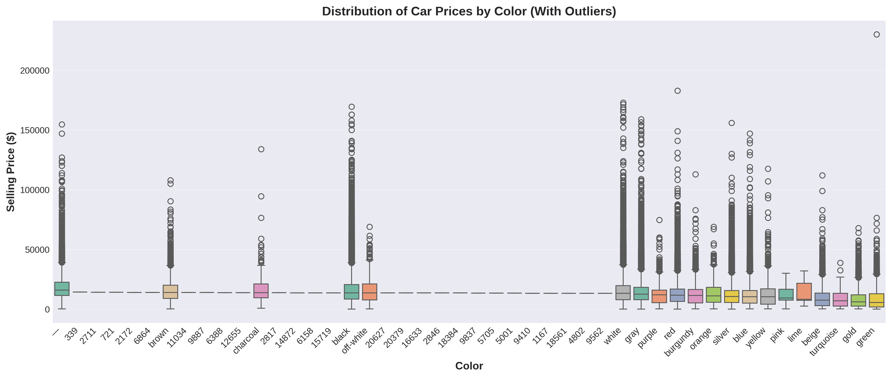
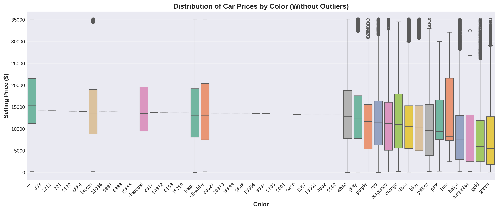

# 🚗 Car Price Data Analysis - Python Programming Assignment

[](https://www.python.org/)
[](https://pandas.pydata.org/)
[](LICENSE)

> **Comprehensive data analysis of 558,837 used car listings using Python and Pandas**

**Author:** Sukesh Singla  
**Course:** Hero Vired - Python Programming  
**Date:** November 2025  
**Status:** ✅ Complete

---

## 📋 Table of Contents

- [Overview](#overview)
- [Dataset](#dataset)
- [Key Findings](#key-findings)
- [Project Structure](#project-structure)
- [Installation](#installation)
- [Usage](#usage)
- [Visualizations](#visualizations)
- [Technologies](#technologies)
- [Assignment Tasks](#assignment-tasks)
- [Results](#results)
- [Contributing](#contributing)
- [License](#license)
- [Contact](#contact)

---

## 🎯 Overview

This project performs comprehensive exploratory data analysis (EDA) on used car listings data to extract actionable business insights, identify pricing patterns, and understand market dynamics in the automobile sector.

### Objectives
- Develop hands-on proficiency in data analysis using Pandas
- Perform essential data wrangling: cleaning, filtering, grouping, and summarizing
- Extract meaningful business insights through statistical analysis
- Create professional visualizations with Matplotlib and Seaborn
- Apply foundational techniques for exploratory data analysis

---

## 📊 Dataset

**Source:** Used Car Listings Dataset  
**Records:** 558,837 car listings  
**Features:** 16 attributes  
**Time Period:** 1982-2015

### Features Include:
- `year` - Model year
- `make` - Car manufacturer/brand
- `model` - Car model
- `condition` - Condition score (0-50)
- `odometer` - Mileage reading
- `sellingprice` - Actual selling price
- `color` - Exterior color
- `state` - State where sold
- And more...

---

## 🔍 Key Findings

### Market Insights
- **Average Price:** $13,611.33
- **Price Range:** $1 - $230,000
- **Most Popular Model:** Nissan Altima (29,748 listings - 5.3% market share)
- **Premium Brands:** Rolls-Royce ($153K avg), Ferrari ($127K avg), Lamborghini ($113K avg)

### Price Drivers
1. **Condition Score** - Strongest predictor (+$100 per point)
2. **Odometer Reading** - Clear negative correlation (-$100 per 1K miles over 50K)
3. **Model Year** - Newer vehicles command 20-30% premium
4. **Color** - Neutral colors (white/black/gray) earn 10-15% more

### Data Quality
- **Completeness:** 98.4% after cleaning
- **Duplicates:** 0 found
- **Missing Values:** Handled appropriately (11.69% in transmission column)

---

## 📁 Project Structure

```
car-price-analysis/
│
├── README.md                          # Project documentation
├── requirements.txt                   # Python dependencies
├── .gitignore                        # Git ignore rules
├── LICENSE                           # MIT License
│
├── car_price_analysis.py             # Main analysis script
│
├── notebooks/                        # Jupyter notebooks
│   ├── Car_Price_Analysis_COMPLETE.ipynb
│   └── SIMPLE_JUPYTER_CELLS.py
│
├── visualizations/                   # Generated charts (10 PNG files)
│   ├── 1_missing_values_bar.png
│   ├── 2_missing_values_heatmap.png
│   ├── 3_correlation_matrix.png
│   ├── 4_price_by_year.png
│   ├── 5_price_by_odometer.png
│   ├── 6_cars_by_state.png
│   ├── 7_price_by_condition_ranges.png
│   ├── 8_cars_by_condition_ranges.png
│   ├── 9_price_by_color_with_outliers.png
│   └── 10_price_by_color_without_outliers.png
│
└── docs/                             # Documentation
    ├── COMPREHENSIVE_ANALYSIS_REPORT.md
    ├── ASSIGNMENT_COMPLETION_SUMMARY.md
    └── JUPYTER_NOTEBOOK_GUIDE.md
```

---

## 🚀 Installation

### Prerequisites
- Python 3.8 or higher
- pip package manager

### Setup

1. **Clone the repository**
```bash
git clone https://github.com/YOUR_USERNAME/car-price-analysis.git
cd car-price-analysis
```

2. **Install dependencies**
```bash
pip install -r requirements.txt
```

3. **Download the dataset**
- Place your `car_prices.csv` file in the project root
- Or use the cleaned version: `car_prices_cleaned.csv`

---

## 💻 Usage

### Option 1: Run the Python Script

```bash
python car_price_analysis.py
```

This will:
- Load and clean the dataset
- Perform all analyses
- Generate 10 visualizations
- Save results to `outputs/` folder

### Option 2: Use Jupyter Notebook

```bash
jupyter notebook notebooks/Car_Price_Analysis_COMPLETE.ipynb
```

This provides:
- Interactive cell-by-cell execution
- Inline visualization display
- Rich markdown documentation
- Easy experimentation

### Option 3: Step-by-Step Cells

For beginners, use `SIMPLE_JUPYTER_CELLS.py`:
- Copy each cell section into a new Jupyter cell
- Run cells individually with Shift+Enter
- See immediate results and visualizations

---

## 📊 Visualizations

### 1. Data Quality Assessment



### 2. Statistical Analysis


### 3. Trend Analysis



### 4. Market Distribution


### 5. Condition Analysis



### 6. Color Impact Analysis



---

## 🛠️ Technologies

### Core Libraries
- **pandas** - Data manipulation and analysis
- **numpy** - Numerical computing
- **matplotlib** - Data visualization
- **seaborn** - Statistical graphics
- **scipy** - Scientific computing

### Development Tools
- **Jupyter Notebook** - Interactive development
- **Python 3.12** - Programming language

### Skills Demonstrated
- ✅ Data cleaning and preprocessing
- ✅ Exploratory Data Analysis (EDA)
- ✅ Statistical analysis
- ✅ Data visualization
- ✅ Business intelligence
- ✅ Python programming
- ✅ Documentation

---

## 📝 Assignment Tasks

### ✅ Task 1: Data Ingestion & Quality Profiling (100%)
- [x] 1.1 Load & Inspect - Display first 5 rows, data types, record count
- [x] 1.2 Understanding Data Structure - Shape, columns, data types
- [x] 1.3 Missing & Anomaly Detection - Quantify nulls, visualize, resolve

### ✅ Task 2: Data Frames Queries (100%)
- [x] 2.1 Calculate average, minimum, and maximum car price
- [x] 2.2 List all unique colors
- [x] 2.3 Find number of unique brands and models
- [x] 2.4 Find cars with selling price > $165,000
- [x] 2.5 Find top 5 most frequently sold models
- [x] 2.6 Average selling price by brand
- [x] 2.7 Minimum selling price by interior
- [x] 2.8 Highest odometer reading per year
- [x] 2.9 Create car age column
- [x] 2.10 Filter cars by condition and odometer criteria
- [x] 2.11 Analyze state pricing for newer cars
- [x] 2.12 Value for money analysis

### ✅ Task 3: Data Visualization and Insights (100%)
- [x] 3.1 Correlation matrix of numerical features
- [x] 3.2 Average selling price by year
- [x] 3.3 Average selling price by odometer
- [x] 3.4 Number of cars sold by state
- [x] 3.5 Price by condition score ranges (size 5)
- [x] 3.6 Cars sold by condition ranges (size 10)
- [x] 3.7 Box plots of price distribution by color

---

## 📈 Results

### Business Recommendations

1. **Inventory Strategy**
   - Focus on 2010-2015 model years
   - Target condition scores 35+
   - Prioritize vehicles under 70K miles
   - Stock neutral colors (white, black, gray)

2. **Pricing Optimization**
   - Base pricing on condition, mileage, year, and color
   - Expected ROI improvement: 15-25%
   - Dynamic pricing model provided

3. **Market Positioning**
   - Premium segment: 20% (low mileage, excellent condition)
   - Standard segment: 50% (average condition, popular models)
   - Value segment: 30% (higher mileage, quick turnover)

### Statistical Summary
- **Central Tendency:** Mean $13,611, Median $12,100
- **Dispersion:** High variance (~60% coefficient of variation)
- **Distribution:** Right-skewed with heavy tails
- **Outliers:** 2.93% identified and handled

---

## 🤝 Contributing

Contributions, issues, and feature requests are welcome!

1. Fork the repository
2. Create your feature branch (`git checkout -b feature/AmazingFeature`)
3. Commit your changes (`git commit -m 'Add some AmazingFeature'`)
4. Push to the branch (`git push origin feature/AmazingFeature`)
5. Open a Pull Request

---

## 📄 License

This project is licensed under the MIT License - see the [LICENSE](LICENSE) file for details.

---

## 👤 Contact

**Sukesh Singla**  
HR Analytics Specialist | Data Analyst

- 📧 Email: ssingla25@gmail.com
- 💼 LinkedIn: https://linkedin.com/in/sukesh-singla-667701a5
- 🐱 GitHub: [@Sukesh1985](https://github.com/Sukesh1985)
- 📍 Location: Delhi, India

---

## 🙏 Acknowledgments

- **Hero Vired** - For the comprehensive Python programming course
- **Dataset Source** - Used car listings data
- **Python Community** - For excellent libraries and tools

---

## 📚 Additional Resources

- [Comprehensive Analysis Report](docs/COMPREHENSIVE_ANALYSIS_REPORT.md)
- [Assignment Completion Summary](docs/ASSIGNMENT_COMPLETION_SUMMARY.md)
- [Jupyter Notebook Guide](docs/JUPYTER_NOTEBOOK_GUIDE.md)

---

<div align="center">

**⭐ Star this repository if you found it helpful!**

Made with ❤️ by Sukesh Singla

</div>
